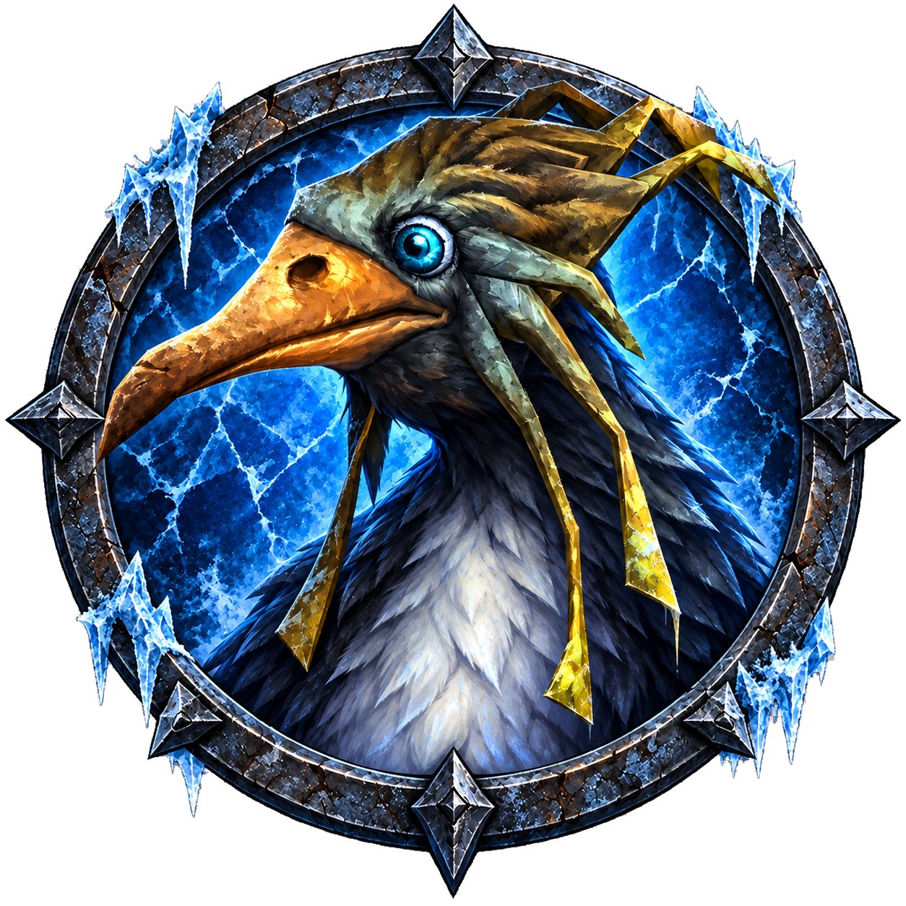
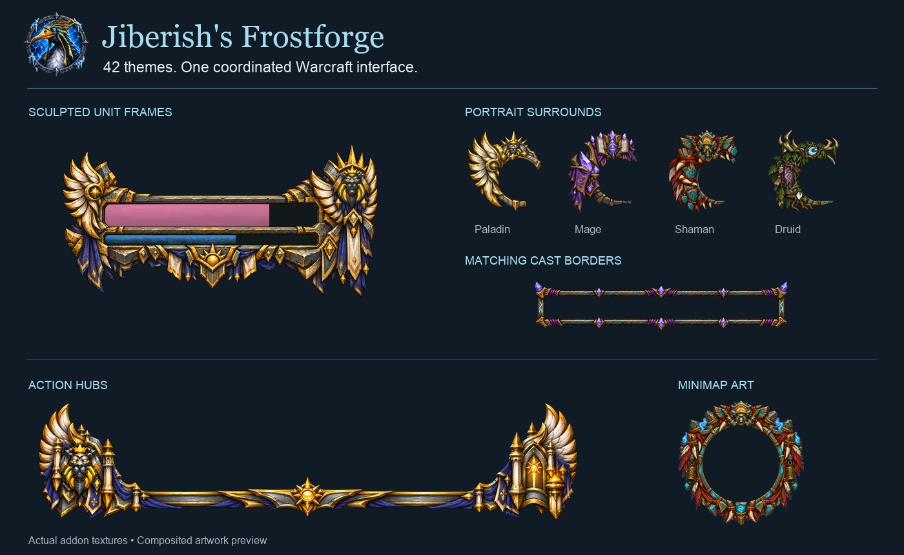
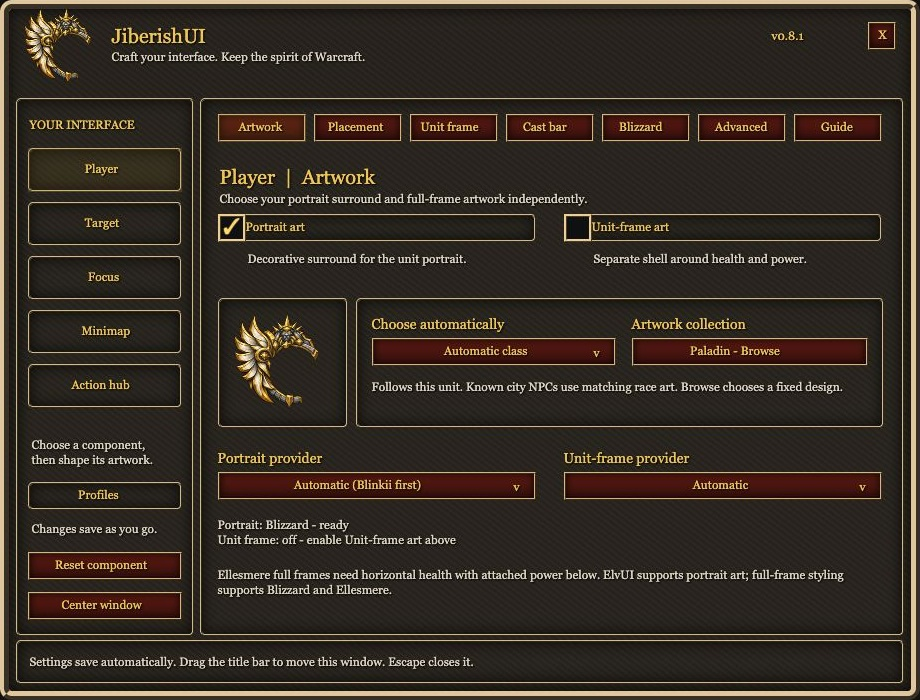

# Jiberish's Frostforge

[Join the Discord](https://discord.com/servers/igloo-460933747731070996)

**Bring the grit, craft, and character of Warcraft into your interface.**

Jiberish's Frostforge adds sculpted artwork around your portraits, health and power bars, cast bars, action bars, and minimap. Build a matching look for your class, race, or faction—from Paladin wings and Priest stonework to Druid roots and Shaman totems.

[The Igloo](https://theigloo.io) · [Artwork gallery](docs/GALLERY.md) · [Getting started](docs/GETTING-STARTED.md) · [Compatibility](#works-with-your-ui) · [Report an issue](https://github.com/jiberishxd/JiberishUI-WoW/issues/new/choose)

*Artwork showcase using the addon's actual textures. See the gallery for labeled previews and an early in-game capture.*

**Current source: 0.9.2 · Development preview.** Retail and Forever packages are built separately. Automated checks cover behavior, artwork fitting and packaging; live-client compatibility and custom layouts still need player testing. There are no packaged [GitHub releases](https://github.com/jiberishxd/JiberishUI-WoW/releases) published yet. To test from source, [build an installable ZIP](docs/DEVELOPMENT.md#build-installable-zips).

## Make it your own

- **42 matching themes:** 13 classes, 26 races, and Alliance, Horde and Neutral. Each has portrait, unit-frame, action-hub, minimap and cast-bar artwork.
- **Independent artwork toggles:** use portrait surrounds, full unit-frame shells and cast-bar borders separately on Player, Target and Focus.
- **Automatic identity:** follow a unit's class, race or faction, or choose a fixed design. Recognized city NPCs use the matching existing race artwork; for example, Undercity → Undead and Stormwind → Human.
- **Fit your layout:** adjust size, offsets, scale and layers. Portrait art, unit-frame art and cast borders each have their own strata. Unit-frame shells have separate width, height and position controls. Bold cast borders have their own width, height, weight and spacing.
- **Stock Blizzard controls:** hide the portrait image or surround, adjust text, use stone and class gradients on health, and choose custom power colors or gradients—including party and raid bars. Move Target/Focus buff/debuff groups and cast bars with separate position controls.
- **A shared stone material:** choose **Frostforge Stone** in compatible EllesmereUI, ElvUI and other LibSharedMedia status-bar texture menus.
- **A Warcraft-style settings workshop:** searchable artwork collections, per-component controls, reset options and copy/paste settings backups.
- **Character profiles:** save named setups and assign them per character. New alts start separately; copy a layout or deliberately share one. [Profile guide](docs/PROFILES.md).

Your frame provider continues to handle health and power values, casts, names, portraits, auras and clicks. Frostforge's decorations are click-through. Full unit-frame styling can apply fill textures and fit power-bar spacing to the artwork; disabling it restores the provider's layout and any fills it managed. The separate stock-wide stone toggle can keep Blizzard bars textured even without shells.

## Works with your UI

These are the integrations implemented in the current build. Support depends on the provider's enabled modules and layout; this table is not a claim that every combination has been validated in game.

| UI / addon | Portrait art | Full unit-frame shells | Cast-bar borders | Action hub |
| --- | --- | --- | --- | --- |
| **Blizzard UI** | Yes | Yes | Yes | Yes |
| **EllesmereUI** | Yes, with a separate portrait | Yes, for compatible bar layouts¹ | Yes | Yes |
| **ElvUI** | Yes, with a separate portrait | Yes¹ | Yes | Yes |
| **Blinkii's Portraits** | Yes | Uses another provider | Uses another provider | Uses another provider |
| **mMediaTag & Tools** | Yes, through ElvUI | Uses ElvUI¹ | Uses ElvUI | Uses ElvUI |

¹ ElvUI and Ellesmere full shells require horizontal health with power attached and aligned below it. ElvUI inset/mini/offset power and detached, above-health or vertical power layouts do not receive a full shell. When power is hidden or absent, complete artwork follows health with a dark empty power opening. Separate/circular portraits give the closest portrait fit; portraits drawn inside health bars have no separate surround to decorate.

The **minimap surround** follows the shared minimap and is designed for a circular map. Action hubs decorate the main bar; keep your preferred addon in charge of its buttons and layout. **Frostforge Stone** can also be used on other frames through your provider's texture settings, including party and raid frames.

Third-party addons must support your game client themselves. Frostforge does not make a Retail-only addon work on Forever. [Detailed provider setup and limitations](docs/ADDON-COMPATIBILITY.md).

## Get started

1. Install the matching **Retail** or **Forever** ZIP. Put its `JiberishUI` folder directly inside your client's `Interface/AddOns/` directory, then fully restart WoW.
2. Enable Frostforge and your preferred UI addon. Open **`/frostforge`**.
3. Choose **Player**, **Target** or **Focus**. In **Artwork**, select automatic class/race/faction matching or browse for a fixed design.
4. Enable **Portrait art** and **Unit-frame art** independently. Portraits start on; full shells start off. Choose the correct providers when using multiple UI addons.
5. Open **Cast bar** to enable its separate border; the provider's cast bar must also be enabled. Then choose matching **Minimap** and **Action hub** artwork if you want a coordinated set.

Settings save as you go. Fitting changes that need to wait for combat apply afterward. Use **Placement** for portraits, **Unit frame** for shell fitting, and **Cast bar** for cast-border fitting. Use **Blizzard** for stock portrait and text controls and the stock-wide stone toggle (on by default); **Cast bar** has cast-border strata and level together; **Advanced** has portrait/shell strata. Your provider's settings still control where its functional frames sit.

*Offline settings preview exported from the addon's settings code; fonts and native panel textures are browser approximations.*

**Upgrading from JiberishUI?** Your profiles, backups and `/jui` / `/jf` commands still work. Keep the install folder named `JiberishUI`; the in-game title is **Jiberish's Frostforge**.

Visit **The Igloo** tab to copy [theigloo.io](https://theigloo.io) into your browser.

For a clean update, close WoW and replace only the existing `Interface/AddOns/JiberishUI` folder. Keep your `WTF` folder and saved settings. [Full setup and troubleshooting](docs/GETTING-STARTED.md).

## Help, feedback and development

- **Missing art or a fitting problem?** Check the toggle and provider for that component, then include `/jui status`, your client/addon versions, and a screenshot in a [bug report](https://github.com/jiberishxd/JiberishUI-WoW/issues/new/choose).
- **Want to share a layout or request an improvement?** Open an [issue](https://github.com/jiberishxd/JiberishUI-WoW/issues/new/choose). [Support guide](SUPPORT.md).
- **Want to contribute?** Read the [contributor guide](CONTRIBUTING.md), [local build instructions](docs/DEVELOPMENT.md), and [validation checklist](docs/VALIDATION.md).

This build decorates Player, Target, Focus, the main action hub and minimap. The plain stone material also covers stock party, raid, pet, boss, target-of-target and focus-target health/power bars; ornamental shells remain limited to Player/Target/Focus. Nameplates are outside this feature. A reported Forever saved-settings loading issue is documented in the [persistence notes](docs/PERSISTENCE.md); keep a settings backup while testing.

Frostforge is an independent community project. [Artwork credits and source references](docs/ARTWORK-CREDITS.md) · [Test results](docs/TEST-RESULTS.md) · [Advanced commands](docs/COMMANDS.md).

Blizzard users can open **Player/Target/Focus → Blizzard → Colors & textures** for class-colored names, class-gradient health, dark stone health, and separate health/power texture choices. Party/raid colors are included; these controls do not require ElvUI or EllesmereUI.
