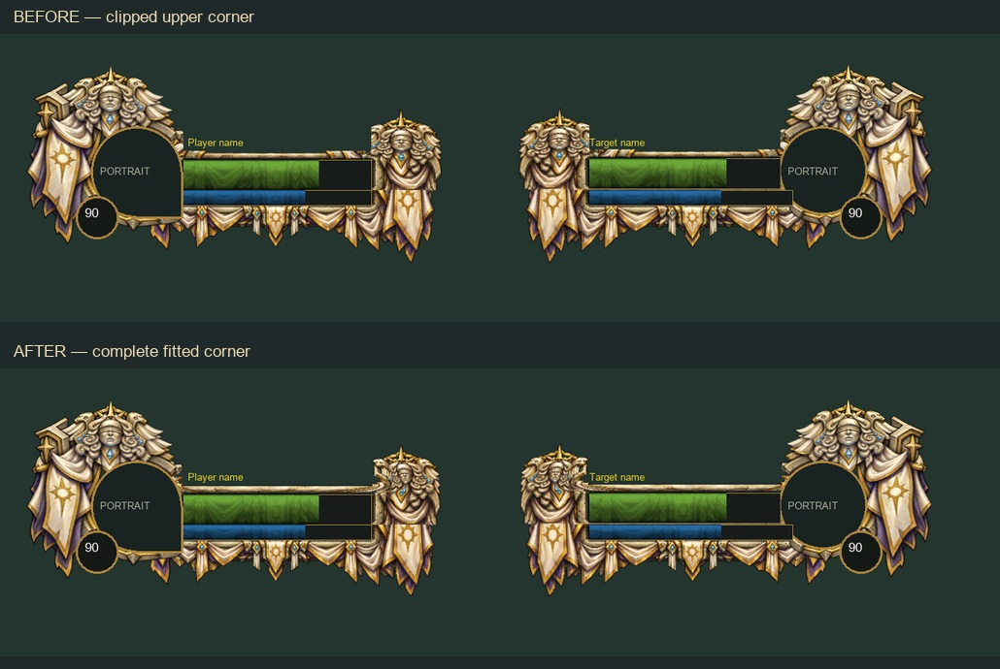

# Artwork fitting audit — 0.7.0-art.2

**Historical record — superseded by 0.7.1.** The user requested the original source silhouettes and thicker borders. Version 0.7.1 replaces both the original compressed export and the audit warp with uniform source fitting and measured openings. It also restores Paladin’s crowned-lion class motif. The 126 portrait/hub/minimap assets remain unchanged; the fitting changes and comparison below are historical.

The Priest corner was an export/fitting error. The artwork source was intact; a rectangular name-clearance mask removed its inner carved detail. The same shared mask affected every full shell to varying degrees.

| Finding | Scope | Correction |
| --- | --- | --- |
| Upper corners cut straight through ornament | 42 full shells; Priest lost 1,427 visible atlas pixels in the name corridor | Fit complete upper shoulders outside the corridor, with a smooth transition into the unchanged bar opening. No repainting or new motifs. |
| Canvas padding erasing extreme tips | 27 full shells; 515 visible atlas pixels across the collection | Fit tips inside the four-pixel padding before export. |
| Gallery thumbnails always showing Player | All full-frame gallery choices | Thumbnails now follow the selected Player, Target or Focus layout. |
| Comparison panes hiding the far edge at narrow widths | Browser fitting preview | Stack panels when two complete canvases do not fit side by side, retaining the selected gameplay pixel size. |

The revised fitter records **zero visible pixels removed** by either the name or outer-margin mask in all 42 shells. Health/power openings remain exactly (96,84)-(396,132) and (96,136)-(396,160), on the same 512 × 256 atlas. Frame dimensions, offsets and runtime section coordinates are unchanged.

The green background, labels, empty portrait silhouettes and level badges above are synthetic review guides. They are not baked into the distributed artwork.

## Inspected and retained

All 13 classes, 26 races and three faction identities were reviewed. Each portrait was checked in both the Player shape and mirrored round Target/Focus shape, alone and paired with its full shell. The complete hub and minimap sheets were also inspected for detached pieces, hard clipping and inconsistent openings. No additional defect requiring artwork changes was identified in those collections at the reviewed scale.

All 126 portrait, hub and minimap runtime assets and all 84 health/power fills are byte-identical to art.1. Original generated shell paintings remain intact. The change is confined to the fitted shell exports and preview accuracy. Differences in wings, cloth, crests and outer silhouettes are intentional identity details; they do not change the shared functional opening.

## Verification and limits

The export pipeline asserts that name clearance and padding discard no painted pixels. Two image-fitting regressions preserve recognizable shoulder/tip markers while testing clear openings and rejection of invalid input. Existing Lua and full media/provenance/package checks remain in force.

The live browser checks use Priest Player at 1440p, Priest Target at 4K and Gnome Focus at 1080p. Review sheets cover all 42 Player and Target/Focus pairings at estimated gameplay size. These checks use synthetic native geometry. Real client layering, unusually long names, custom offsets, and native screen-edge placement still need in-game confirmation. No addon was installed into either WoW client during this audit.
