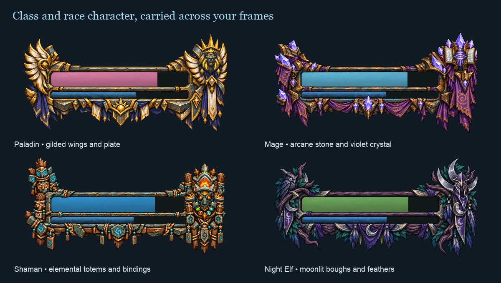
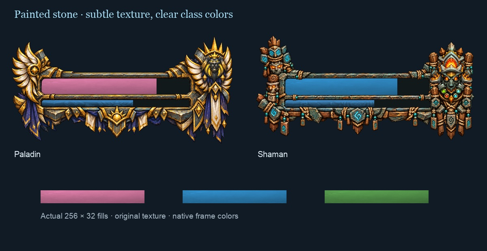
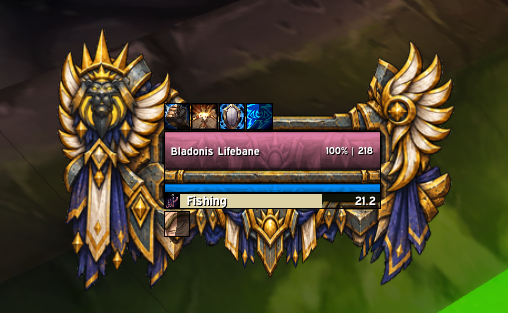
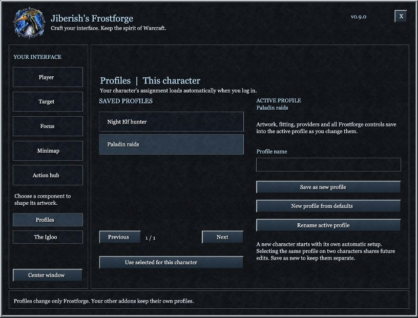
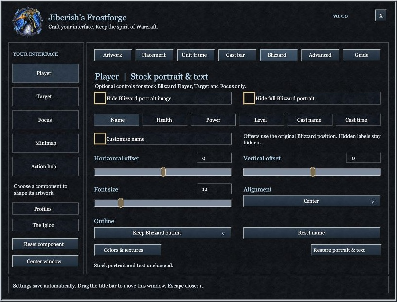

# Frostforge artwork gallery

The current collection includes 13 classes, 26 races and three factions. Each theme has matching portrait, unit-frame, action-hub, minimap and cast-bar artwork. Components can be enabled and fitted independently.

## A coordinated interface

Actual shipped artwork, arranged as a documentation showcase. Health and power fills are illustrative compositions using the addon's textures; this is not a game screenshot.

## Sculpted unit frames

Paladin wings and armor, Mage crystal and arcane motifs, Shaman totems and bindings, and Night Elf branches and feathers. These previews use the measured shell openings and shipped fill textures. Colors and sample fill amounts illustrate the material; the provider controls live values and tinting.

## Shared painted stone

Original hand-painted stone with quiet wear and broad shading. The lower samples show the actual 256 × 32 fill pixels with illustrative class tints. Choose **Frostforge Stone** in compatible provider texture menus; the same material can cover stock Blizzard health and power through Frostforge's Blizzard settings. This is an offline composition, not a game screenshot.

## In-game test capture

Player-shared capture of the Paladin shell with EllesmereUI from an earlier test build. The health texture shown here predates the current plain-stone/provider-texture update. This demonstrates an early in-game appearance, not validation of every current client/provider combination.

## Settings workshop

Offline browser capture exported from the addon's settings objects. Native fonts and panel textures are approximated. The controls shown include provider selection, independent artwork toggles, collections, per-component pages and reset controls.

## Character profiles

Offline capture of the actual Profiles layout. Example names illustrate separate setups; each character remembers its selected profile. [Saving and assigning profiles](PROFILES.md).

## Stock Blizzard options

Offline settings preview of the optional native portrait/name controls and the stock-wide health/power material toggle.

## Browse every theme locally

The repository includes interactive fitting previews for [portraits](https://github.com/jiberishxd/JiberishUI-WoW/tree/main/artwork/portraits/), [unit frames](https://github.com/jiberishxd/JiberishUI-WoW/tree/main/artwork/unit-frames/), [action hubs](https://github.com/jiberishxd/JiberishUI-WoW/tree/main/artwork/hubs/), [minimaps](https://github.com/jiberishxd/JiberishUI-WoW/tree/main/artwork/minimaps/) and [cast bars](https://github.com/jiberishxd/JiberishUI-WoW/tree/main/artwork/cast-bars/). GitHub shows the source folders; [serve the repository locally](DEVELOPMENT.md#local-checks) to use the preview pages. No game interaction is needed to browse them.

Have a layout to share? [Open a layout or artwork feedback issue](https://github.com/jiberishxd/JiberishUI-WoW/issues/new?template=feature_request.yml) and include the UI provider, selected themes and a screenshot.
